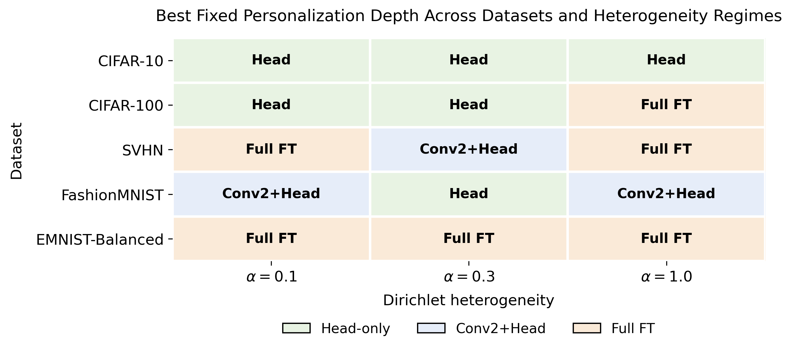
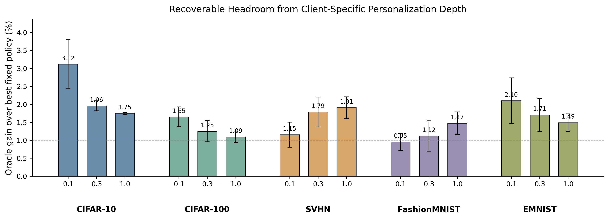
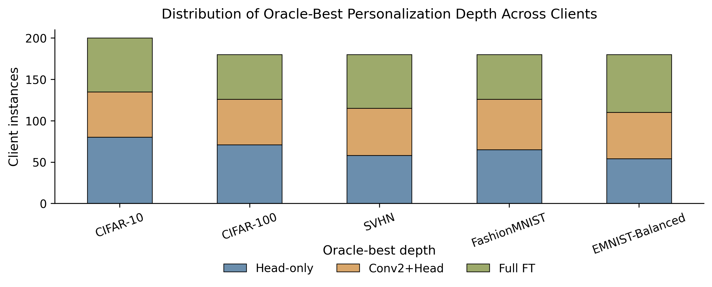
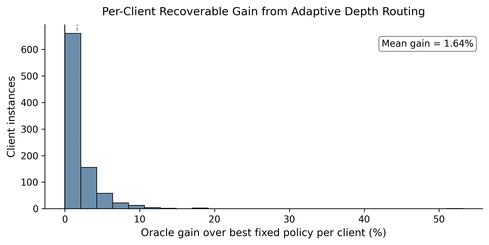
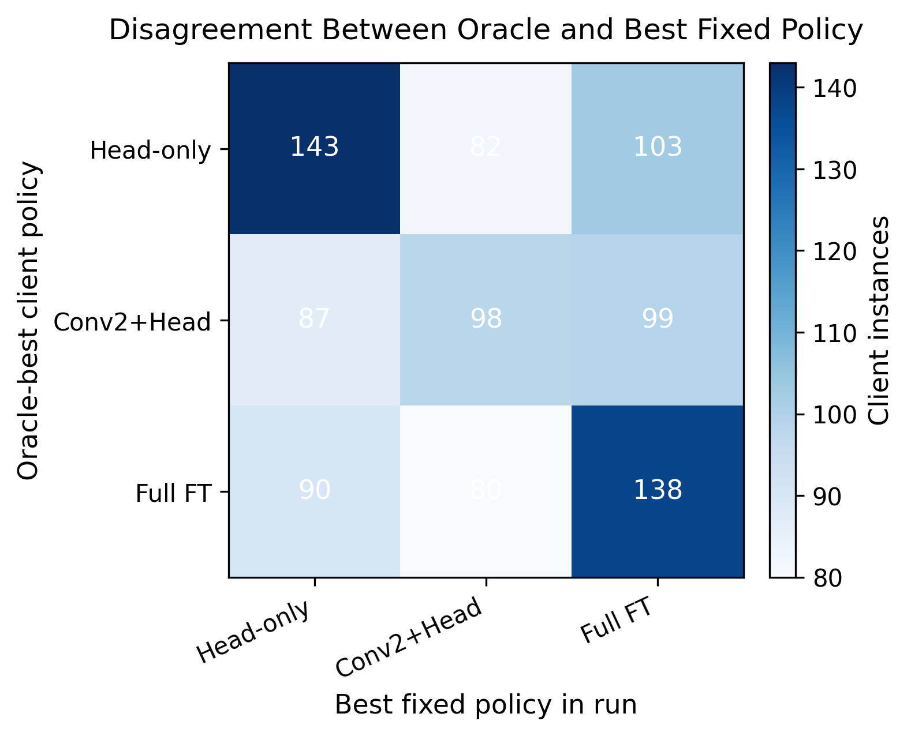
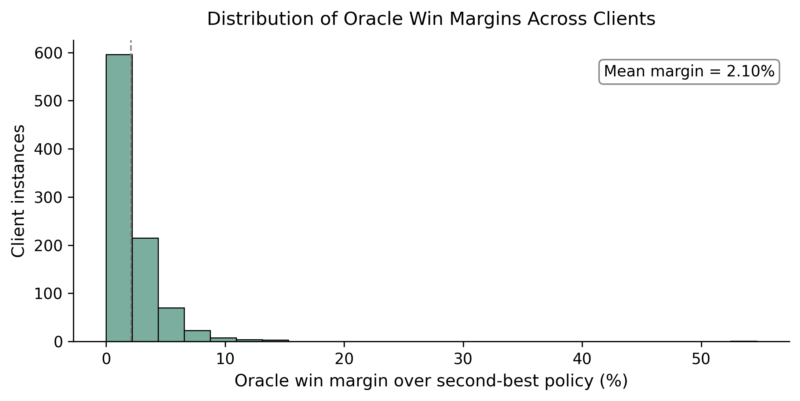

# How Much Should Each Client Personalize?

## Adaptation Depth in Federated Learning

This repository contains the implementation, experimental artifacts, figures, and analysis for a research study on **client-specific personalization depth in federated learning**.

The central question is:

> How much of a shared model should each client personalize after federated training?

## Key Insight

Personalization depth is not globally optimal. Different clients can prefer different adaptation depths within the same federated run, and forcing all clients to use a single policy leaves measurable performance unrealized.

## Overview

Personalized federated learning is commonly motivated by client heterogeneity, but many systems still apply the same adaptation strategy to every client. This project studies **personalization depth** as a client-dependent decision.

The study compares three post-hoc personalization policies:

- **Head-only fine-tuning**
- **Partial fine-tuning**
- **Full fine-tuning**

Experiments are conducted across five benchmark datasets and multiple Dirichlet non-IID regimes.

## Main Contributions

- Formulates client-specific personalization depth as a distinct federated learning decision problem.
- Evaluates head-only, partial, and full fine-tuning across multiple datasets and heterogeneity regimes.
- Quantifies oracle client-wise routing headroom beyond the strongest fixed policy.
- Analyzes client-level variation in preferred adaptation depth.
- Evaluates lightweight automatic selectors and shows that recovering oracle gains is nontrivial.

## Datasets

- CIFAR-10
- CIFAR-100
- SVHN
- FashionMNIST
- EMNIST-Balanced

Each dataset is evaluated under Dirichlet non-IID client partitions with multiple heterogeneity settings and random seeds.

## Repository Structure

```text
federated-personalization-depth/
├── src/             # Core implementation
├── configs/         # Dataset-level experiment configurations
├── scripts/         # Reproduction and analysis helpers
├── results/         # Raw and aggregated experiment outputs
├── figures/         # Consolidated final figures
├── analysis/        # Analysis notes and diagnostics
├── docs/            # Methodology and reproducibility documentation
├── notebooks/       # Exploratory notebooks
├── pyproject.toml
├── requirements.txt
└── README.md
```

## Key Results and Figures

### Winning Fixed Personalization Depth



### Oracle Routing Headroom



### Client-Level Depth Preferences



### Per-Client Oracle Gains



### Oracle vs Fixed Policy Disagreement



### Oracle Win Margins



## Reproducibility

Install dependencies:

```bash
pip install -r requirements.txt
```

Aggregate stored results:

```bash
python scripts/aggregate_results.py
```

Verify figure availability:

```bash
python scripts/reproduce_figures.py
```

The repository includes stored outputs and final figures so that the main empirical claims can be inspected without rerunning the full experimental sweep.

## Limitations

- Oracle routing is an upper bound, not a deployable method.
- Lightweight selectors do not consistently recover oracle-level gains.
- Experiments focus on controlled benchmark datasets with synthetic Dirichlet partitions.
- Additional validation on real-world federated datasets would strengthen external validity.

## Research Contribution

This project identifies **personalization depth** as a distinct axis of heterogeneity in federated learning. It shows that fixed personalization policies leave measurable performance unrealized and that adaptive depth selection is a nontrivial client-level decision problem.

## Author

Victor Obarafor

## License

MIT License
